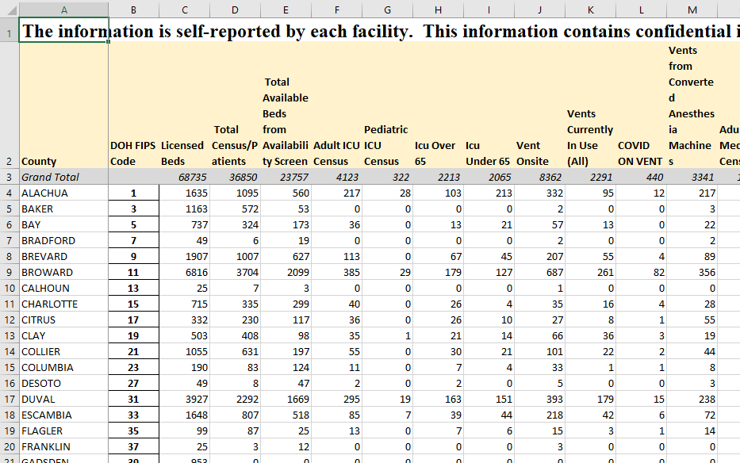
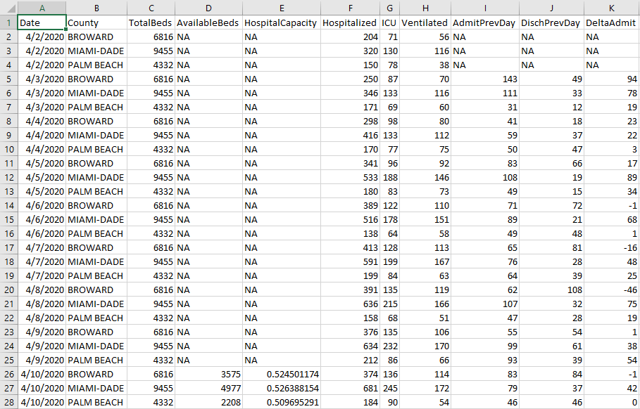
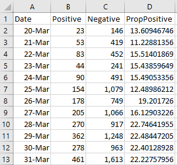

```{r setup, include=FALSE}
knitr::opts_chunk$set(echo = FALSE)
```


# Introduction

## The Finished Product
- Our work was cited by CNN: <https://www.cnn.com/2020/06/24/us/florida-coronavirus-cases-surge/index.html>
- Our report is here: <https://rwilli5.github.io/MiamiCovidProject/>

## COVID-19 Overview
- COVID-19 is the illness caused by the virus SARS-Cov-2
- While the virus itself is not "airborne" naturally, it can travel on exhaled saliva droplets, giving it many characteristics of an airborne virus
- Worldwide, there have been roughly 12 million cases and over half a million deaths in the past 6 months
- In South Florida, we have had `r format(40265 + 17116 + 14859, scientific = FALSE)` cases with `r 1018 + 394 + 523` deaths since mid March
- As of yesterday's data, the proportion of positive cases had a 26.4 day doubling time


# Raw Data and Sources

## Data Sources
- AHCA, Florida’s Agency for Health Care Administration: <https://ahca.myflorida.com>. Note: this data contains PHI, so it's not available online. These reports are supposed to be sent out daily, but we often miss days.
- FLDoH, the State of Florida's Department of Health: <https://floridahealthcovid19.gov>.
- FDEM, the State of Florida's Division of Emergency Management: <https://www.floridadisaster.org/covid19/covid-19-data-reports/>


## AHCA Data Snapshot


## FL DoH Data Snapshot
- The state releases a daily report (except for when they don't) for all counties showing testing results.
<http://ww11.doh.state.fl.us/comm/_partners/covid19_report_archive/county_reports_latest.pdf>
- Historic data was available at websites like these (**was**, they've since been taken down): <http://ww11.doh.state.fl.us/comm/_partners/action/report_archive/county/county_reports_20200617.pdf>


## FDEM Data Snapshot
The state releases a twice-daily report for the whole state, and they give access to historic data: <https://www.floridadisaster.org/covid19/covid-19-data-reports/>

- Pro: we have data going back to March 16th.
- Cons: the data is in the form of a running total, so it's challenging to get daily values. Also, data does not match what is shown by the DoH. Finally, the website URLs change unpredictably, so we can't automatically scrape the data.


# Data Cleaning

## Data Cleaning
- Most of the DoH and FDEM data has to be extracted by hand because the data formats change
- We write scripts in R to import all the AHCA data as a group (but that has its challenges too). Let's take a look...

## Cleaned AHCA Data
This is a snapshot of the cleaned AHCA data for South Florida (Miami-Dade, Broward, and Palm Beach counties).



## Cleaned FLDoH and FDEM Data
This is a snapshot of the data for Miami-Dade County: 




# Building a Report

## Building Professional Reports
- Using this cleaned data, we build a report using R.
- Once we have the report built as a `.html` file, we build and publish a website using Python.
- Let's take a look...


# Conclusion

## Conclusion
- Wash your hands
- Wear a mask in public
- Don't go out unless absolutely necessary
